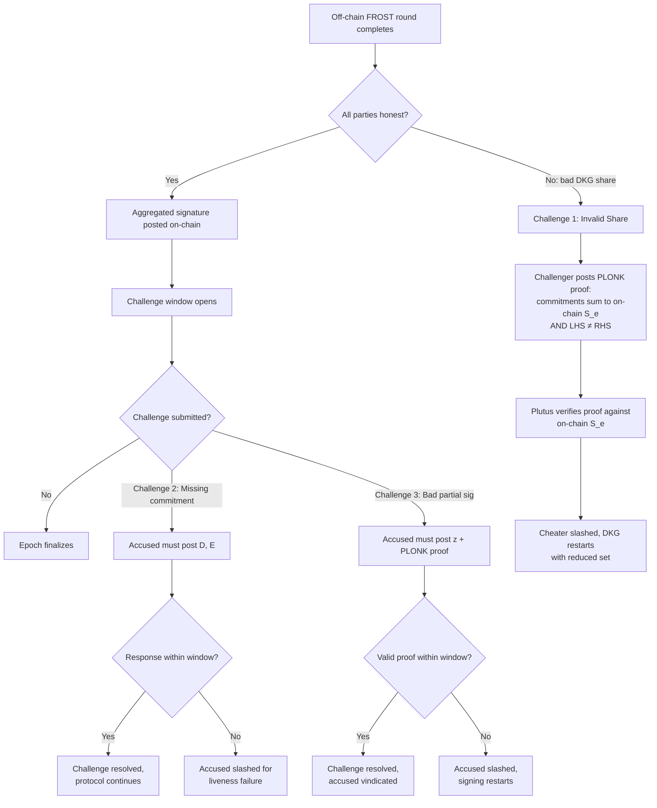
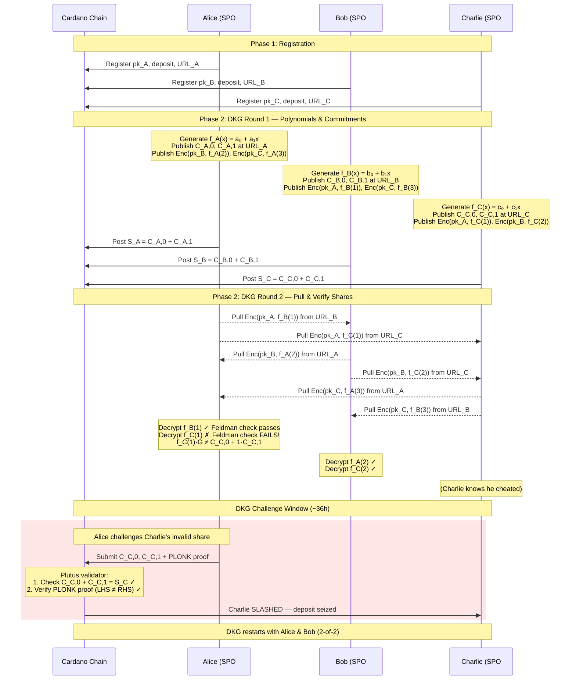
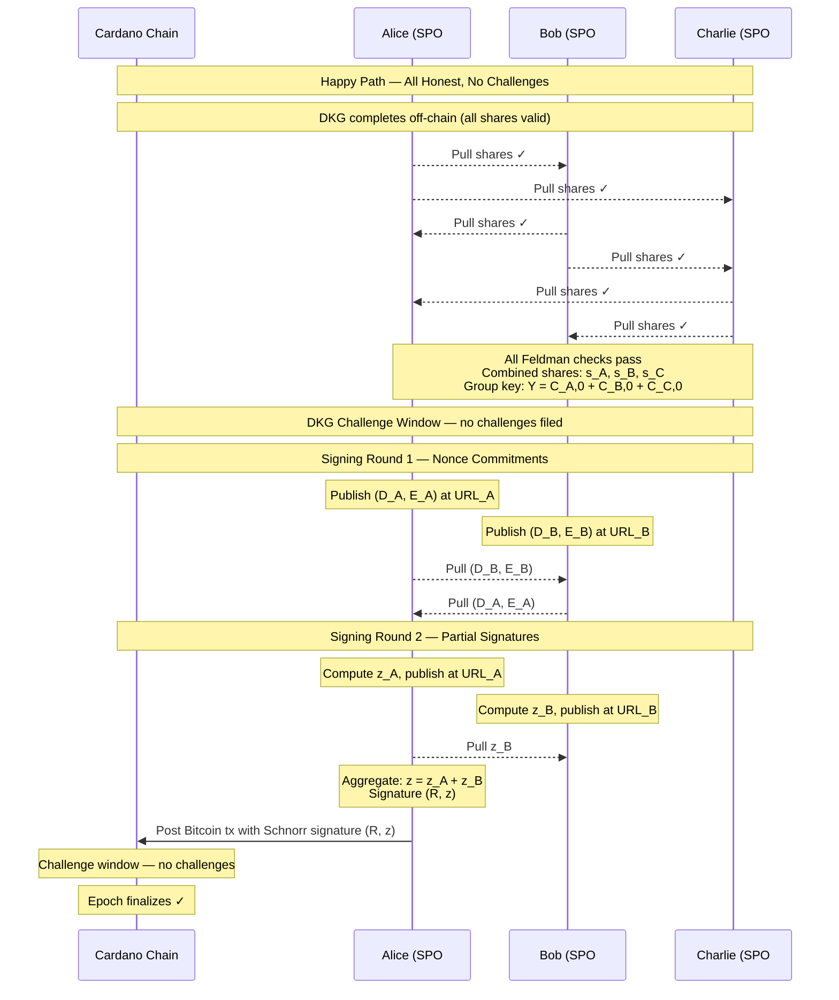

# Optimistic FROST Protocol

## Overview

Cardano Stake Pool Operators (SPOs) jointly custody Bitcoin using FROST $M$-of-$N$ threshold Schnorr signatures. The protocol is **optimistic**: all FROST communication (DKG and signing) happens off-chain via a **pull-only** model — each SPO publishes protocol data at their Bifrost URL endpoint, and other participants fetch it on their own schedule. No party sends data directly to another. Only the final aggregated signature is posted on-chain. If any participant misbehaves, any honest party can submit a **challenge** on Cardano, forcing the accused to respond with a **PLONK proof** of correct computation — or be slashed.

This design minimizes on-chain cost to near-zero in the honest case while preserving full accountability through succinct zero-knowledge proofs verifiable via Plutus V3 BLS12-381 builtins.

## Protocol Phases

### Phase 1: Registration

Each SPO publishes a registration transaction on Cardano containing:

- Their Bifrost identity public key $pk_j$ (secp256k1)
- A security deposit (slashable collateral)
- Their Bifrost URL (endpoint where this SPO publishes protocol data for others to pull)

A membership token is minted and the SPO is added to the Patricia Merkle Tree.

### Phase 2: Distributed Key Generation (DKG)

Runs off-chain at the start of each epoch. All data exchange uses the **pull model** — each SPO publishes at their Bifrost URL, others fetch.

Each SPO $j$:

1. Generates a random degree-$(t{-}1)$ polynomial $f_j(x) = a_{j,0} + a_{j,1}x + \cdots + a_{j,t-1}x^{t-1}$
2. Publishes individual commitments $C_{j,k} = a_{j,k} \cdot G$ for $k = 0 \ldots t{-}1$ **off-chain** at their endpoint
3. Publishes encrypted secret shares $\text{Enc}(pk_i,\ s_{j,i})$ for each participant $i$ at their endpoint — each recipient pulls and decrypts their own share via ECDH

**On-chain commitment:** SPO $j$ publishes a single transaction containing:
- $C_{j,0}$ — their public key share (needed for the group key $Y = \sum_j C_{j,0}$)
- $S_j = \sum_{k=0}^{t-1} C_{j,k}$ — the **sum of all commitments**, a compact on-chain binding to their full polynomial

Individual commitments $C_{j,k}$ are **not** stored on-chain — only $S_j$ is. This reduces on-chain storage from $O(t)$ points per SPO to a single point.

**Feldman VSS verification:** Each recipient $i$ pulls share $s_{j,i}$ and all individual commitments $C_{j,k}$ from SPO $j$'s endpoint, decrypts the share, and checks:

$$s_{j,i} \cdot G \stackrel{?}{=} \sum_{k=0}^{t-1} i^k \cdot C_{j,k}$$

If this fails, $i$ has evidence that $j$ cheated.

### Phase 3: Signing

When a Bitcoin transaction needs signing (peg-out or treasury handoff):

**Round 1 — Nonce Commitment:** Each signing SPO $p$ generates nonce pair $(d_p, e_p)$ and publishes commitments $(D_p, E_p) = (d_p \cdot G,\ e_p \cdot G)$ at their endpoint. Other participants pull all commitments.

**Round 2 — Partial Signature:** Each SPO $p$ pulls all commitments from round 1, then computes:

- Binding factor: $\rho_p = H(Y \| \text{commitments} \| m \| p)$
- Group commitment: $R = \sum(D_p + \rho_p \cdot E_p)$
- Challenge: $c = H(R \| Y \| m)$
- Lagrange coefficient: $\lambda_p$
- Signature share: $z_p = d_p + \rho_p \cdot e_p + \lambda_p \cdot s_p \cdot c$

Each SPO publishes $z_p$ at their endpoint.

**Aggregation:** Any party pulls all $z_p$ values and computes $z = \sum z_p$. Final Schnorr signature $(R, z)$ is broadcast to Bitcoin.

### Phase 4: Finalization

The aggregated signature is submitted as a Bitcoin transaction. A watchtower posts the inclusion proof on Cardano via the Binocular Oracle. If no challenges arise during the challenge window, the epoch finalizes.

## Challenge-Response Protocol

All challenges are submitted as Cardano transactions. The accused party has a fixed window (one challenge period, ~36 hours) to respond. Failure to respond results in slashing.

### Challenge 1: Invalid DKG Share

**Trigger:** SPO $a$ pulls their encrypted share and individual commitments from SPO $e$'s endpoint, decrypts the share, and Feldman verification fails:

$$s_{e,a} \cdot G \neq \sum_{k=0}^{t-1} a^k \cdot C_{e,k}$$

**Challenge tx:** SPO $a$ submits the individual commitments $C_{e,k}$ and a PLONK proof with:
- **Public inputs**: individual commitments $C_{e,k}$, participant index $a$, LHS and RHS points
- **Private witnesses**: share $s_{e,a}$

The circuit proves: LHS $\neq$ RHS (the share is inconsistent with the commitments).

**On-chain verification:** The Plutus validator:
1. Checks $\sum_k C_{e,k} = S_e$ (the submitted commitments match the on-chain sum — simple EC addition, no ZK needed)
2. Verifies the PLONK proof against the public inputs

If both pass, SPO $e$ is slashed. The sum check binds the proof to the specific SPO's on-chain commitment; the PLONK proof proves the Feldman VSS mismatch.

**Response:** SPO $e$ cannot dispute — the proof is non-interactive and $S_e$ was published by $e$ themselves.

### Challenge 2: Missing Nonce Commitment

**Trigger:** SPO $e$'s endpoint does not serve $(D_e, E_e)$ during signing round 1 (data unavailable when pulled).

**Challenge tx:** Any SPO posts a challenge asserting that SPO $e$'s nonce commitments are absent.

**Response:** SPO $e$ must post a transaction containing $(D_e, E_e)$ within the challenge period.

**Timeout:** If no response, SPO $e$ is slashed for liveness failure.

### Challenge 3: Invalid Partial Signature

**Trigger:** The aggregated signature fails verification, or an individual share $z_p$ is inconsistent:

$$z_p \cdot G \neq D_p + \rho_p \cdot E_p + \lambda_p \cdot c \cdot Y_p$$

where $Y_p = s_p \cdot G$ is SPO $p$'s verification share.

**Challenge tx:** Any party posts a challenge against SPO $e$'s partial signature.

**Response:** SPO $e$ must post $z_e$ along with a PLONK proof of correct computation:
- Proves $z_e = d_e + \rho_e \cdot e_e + \lambda_e \cdot s_e \cdot c$ without revealing secret values
- Proves consistency with their published $(D_e, E_e)$ and verification share $Y_e$

**Timeout:** If no valid response, SPO $e$ is slashed.

## PLONK Proof System

All zero-knowledge proofs use PLONK over **BLS12-381**, directly verifiable on Cardano via Plutus V3 native builtins.

### DKG Share Misbehavior Proof

| | |
|---|---|
| **Public inputs** | Individual commitments $C_{e,k}$, participant index $a$, LHS point, RHS point |
| **Private witnesses** | Share $s_{e,a}$ |
| **Circuit proves** | $s \cdot G \neq \sum i^k \cdot C_k$ (Feldman VSS mismatch) |
| **On-chain check** (outside proof) | $\sum_k C_{e,k} = S_e$ (binds commitments to on-chain sum) |
| **Proof size** | 1008 bytes |

### Partial Signature Correctness Proof

| | |
|---|---|
| **Public inputs** | $(D_e, E_e)$, verification share $Y_e$, challenge $c$, binding factor $\rho_e$ |
| **Private witnesses** | Nonce secrets $(d_e, e_e)$, signing share $s_e$ |
| **Circuit proves** | $z_e = d_e + \rho_e \cdot e_e + \lambda_e \cdot s_e \cdot c$ consistent with public values |
| **Proof size** | 1008 bytes |

### Key Properties

- **Minimal on-chain storage:** only $S_e$ stored on-chain per SPO; individual commitments submitted by challenger at dispute time and verified against $S_e$ via simple EC sum
- **Universal circuit:** compiled once for max $N$ signers, works for any threshold $M \leq N$
- **Non-native arithmetic:** secp256k1 operations inside BLS12-381 via 4x64-bit limb decomposition
- **Succinct:** constant 1008-byte proof regardless of number of participants
- **Fast:** ~1s proof generation, ~40ms verification off-chain

## Epoch Timeline

Each Cardano epoch (~5 days) is divided into phases with challenge windows:

| Phase | Duration | Activity |
|-------|----------|----------|
| DKG Rounds | ~12 hours | Off-chain: SPOs run DKG rounds 1-3 |
| DKG Challenge Window | ~36 hours | On-chain: challenges for invalid shares |
| Signing Round 1 | ~6 hours | Off-chain: nonce commitments $(D_p, E_p)$ |
| Commitment Challenge Window | ~12 hours | On-chain: challenges for missing commitments |
| Signing Round 2 | ~6 hours | Off-chain: partial signatures $z_p$ |
| Signature Challenge Window | ~36 hours | On-chain: challenges for invalid partial sigs |
| Finalization | ~12 hours | Treasury handoff, epoch transition |

## Flowcharts

### Challenge-Response Flow

### Multi-Epoch Timeline

```mermaid
flowchart LR
    subgraph Epoch_K ["Epoch K"]
        direction TB
        K1[DKG Rounds\n~12h off-chain] --> K2[DKG Challenge\nWindow ~36h]
        K2 --> K3{Challenges?}
        K3 -->|None| K4[Sign Round 1\nNonces ~6h]
        K3 -->|Slash + Restart| K1
        K4 --> K5[Commitment Challenge\n~12h]
        K5 --> K6{Missing?}
        K6 -->|None| K7[Sign Round 2\nPartial sigs ~6h]
        K6 -->|Slash| K4
        K7 --> K8[Signature Challenge\n~36h]
        K8 --> K9{Invalid sig?}
        K9 -->|None| K10[Finalize\nTreasury handoff]
        K9 -->|Slash| K7
    end

    subgraph Epoch_K1 ["Epoch K+1"]
        direction TB
        L1[New roster\nDKG Rounds] --> L2[DKG Challenge\nWindow]
        L2 --> L3[Signing Rounds]
        L3 --> L4[Challenge Windows]
        L4 --> L5[Finalize]
    end

    K10 -->|New group key Y\nTreasury migrated| L1
```

### Example: 2-of-3 DKG with Cheating SPO

Three SPOs (Alice, Bob, Charlie) run a 2-of-3 FROST DKG. Charlie sends a bad share to Alice.

## Communication Model

All off-chain protocol data flows through a **pull-only** model:

- Each SPO runs an HTTP endpoint at their registered Bifrost URL
- During each protocol round, an SPO computes their output and publishes it at their endpoint
- Other participants poll endpoints to fetch the data they need
- No SPO ever pushes data to another — all fetching is initiated by the receiver
- Encrypted shares use ECDH: SPO $j$ publishes $\text{Enc}(pk_i, s_{j,i})$ for all $i$; only recipient $i$ can decrypt

This model has key advantages:
- **No coordination:** SPOs operate independently, publishing at their own pace within the round window
- **No NAT/firewall issues:** only outbound HTTP requests needed to participate
- **Censorship resistance:** data availability is the publisher's responsibility — failure to publish is a challengeable offense
- **Simplicity:** no message routing, no relay infrastructure, no peer-to-peer networking

## Security Properties

- **Optimistic efficiency:** Zero on-chain cost when all parties are honest — only the final Bitcoin transaction and its Cardano proof matter.
- **Identifiable abort:** Every misbehavior is attributable to a specific SPO via PLONK proofs.
- **Economic security:** Slashing deposits make attacks costly. An attacker must forfeit their deposit and loses SPO membership.
- **Liveness:** Protocol tolerates up to $N - M$ offline SPOs. Only $M$ honest participants needed to produce a valid signature.
- **One honest challenger:** A single honest SPO (or watchtower) is sufficient to detect and prove misbehavior.
- **Succinctness:** On-chain storage is $O(1)$ per SPO (single point $S_j$). Disputes require submitting $O(t)$ commitments, but only in the rare challenge case.
- **Minimal on-chain footprint:** each SPO stores only one point $S_j$ on-chain; individual commitments only appear on-chain during disputes.
